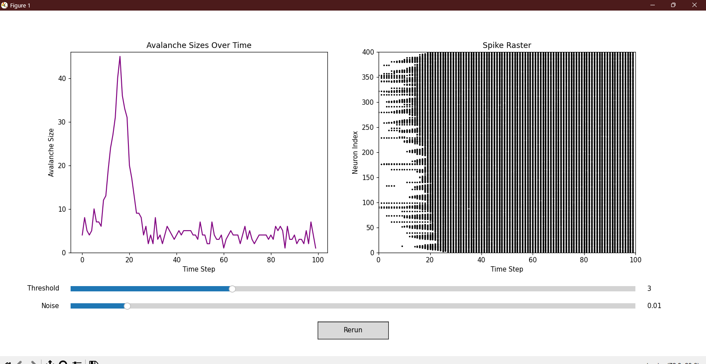

# Brain Criticality - Simulating Neural Avalanches
  This project simulates neural avalanches which are bursts of activity spreading through a network of neurons. It uses a 2D cellular automation model and built entirely with NumPy and Matplotlib. This visualization will demonstrate how local interactions and stochastic perturbations can lead to emergent cascading behaviors in neural systems. The simulation includes an interactive dashboard which will allow for real time adjustments of its parameters such as the activation thresholds and noise level. 

This project was done with the intention to bridge neuroscience, physics, and computer science in order to explore self organized criticality, complex systems, and stochastic dynamics. Specifically this project will be used as an entry point for computational neuroscience and dynamical systems analysis. 

# Objectives: 
* Model a simplified 2D grid of binary neurons (active/inactive)
* Track and quantify neuronal avalanches (contiguous activations over time)
* Visualize neuronal dynamics in both aggregate (avalanche sizes) and individual (spike raster) form
* Allow interactive manipulation of core parameters, including:
  * Threshold: number of active neighbors required to activate a neuron.
  * Noise: Probability of random state flips (simulating stochastic firing)
* Build all components using foundational python libraries and only using numpy and matplotlib

# Biological and Physical Motivation 
In the brain, neural avalanches are spontaneous cascades of firing activity. This was thought to be indicative of a brain operating near criticality (an optimal balance between order and chaos). This balance is believe to maximize computational power, dynamical range, and information capacity. 

This simulation serves as a toy model for: criticality in neural systems, stochastic propagation in excitable media, and emergence of complex dynamics from simple local rules. 

# Visual Output 
This program plots the number of neurons activated per time step. Spikes indicate large cascades, often caused by favorable local activation and noise. It also displays which neurons fired at each time step. The x-axis is time, and the y-axis represents neuron indices (flattened from 2D grid). Dense vertical bands indicate widespread firing. 

# How it works: 
A 2D array of zeros (inactive neurons) is initialized. A single neuron is randomly set active to seed the cascade. For each neuron we check the 8 sorrounding neighbors. If the number of active neighbots is greater than or equal to the threshold then the neuron becomes active. Independently, a noise parameter introduces a random chance of flipping state. At each time step, the number of neurons that became active is counted as the avalanche size for that time step. Each state of the grid is recorded to later visualize which neurons fired at which time. Sliders and buttoons are created using matplotlib wdigets which allows us to adjust the threshold or noise reruns and make the results instantly update in both plots. 

# Output Example: 

